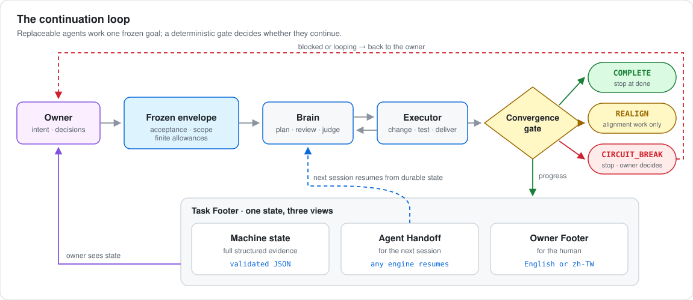
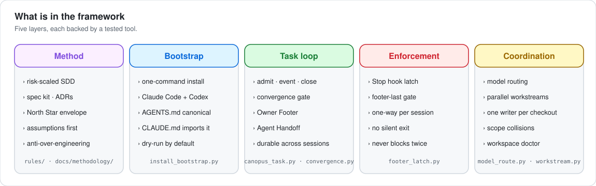
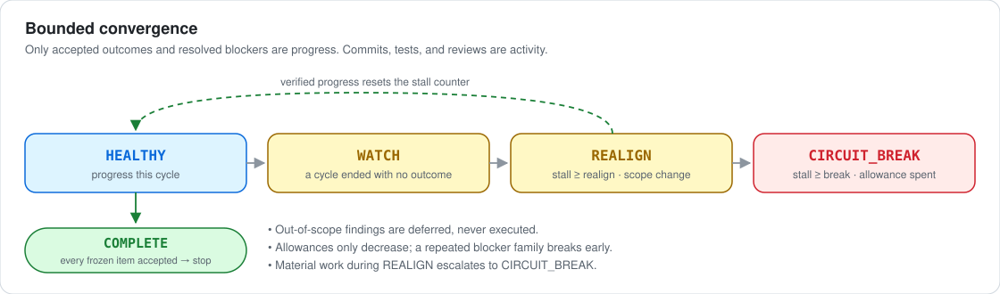

# Canopus — keep long-running AI agents locked on their goal

Spacecraft on multi-year missions used a *Canopus star tracker* to lock onto one
bright star and hold their orientation. **Canopus** does the same for AI coding
agents such as Claude Code and Codex: a small, complete framework for running
them with engineering discipline. It turns an ambiguous request into a frozen, acceptance-checkable
goal; lets replaceable agents push that goal forward across sessions, engines,
and machines; and **stops them deterministically when they drift, loop, or
over-engineer** — while every project's data stays in its own repository.

It is plain standard-library Python and Markdown that you can adopt in about
15 minutes.

> [`docs/EVIDENCE.md`](docs/EVIDENCE.md) maps every behavior to the test that
> proves it.

<picture>
  <source media="(prefers-color-scheme: dark)" srcset="docs/assets/continuation-loop-dark.svg">
  
</picture>

## Why it exists

AI agents are productive inside one chat and unreliable across many. The
failures are predictable:

| Failure | What Canopus does instead |
| --- | --- |
| Chat becomes the database; a new session forgets what was accepted | Task state lives in the task's Issue and Task Footer; every session resumes from it |
| Commits, tests, and reviews look like progress | Only closed acceptance items and resolved blockers count as progress |
| Every "reasonable" finding grows the scope | The envelope is frozen; out-of-scope findings are deferred, widening needs re-admission |
| Review/fix loops never end | Finite allowances that never replenish, and a circuit breaker on stagnation |
| Prompt rules are followed "usually" | A Claude Code Stop hook blocks a latched turn that ends without the status footer and sends it back once to fix |
| Agents copy data across boundaries, or over-apply a boundary and stop working | Processing and storage are separate questions with separate rules |

## What is in the box

<picture>
  <source media="(prefers-color-scheme: dark)" srcset="docs/assets/framework-map-dark.svg">
  
</picture>

| Layer | Read | Run |
| --- | --- | --- |
| **Method** — risk-scaled SDD, spec kit, ADRs, North Star envelope, assumptions first, anti-over-engineering | [`docs/methodology/`](docs/methodology/), [`rules/`](rules/) | — |
| **Bootstrap** — one command installs the rules into Claude Code and Codex; project `AGENTS.md` is canonical, `CLAUDE.md` imports it | [`templates/`](templates/), [`playbooks/adopting-canopus.md`](playbooks/adopting-canopus.md) | `tools/install_bootstrap.py` |
| **Task loop** — admit a task with a frozen envelope, record events, render the Owner Footer and Agent Handoff, close it | [`rules/session.md`](rules/session.md), [`docs/methodology/continuation-loop.md`](docs/methodology/continuation-loop.md) | `tools/canopus_task.py`, `tools/convergence.py` |
| **Enforcement** — a one-way per-session latch and a Stop hook that blocks a response without the footer | [`docs/methodology/deterministic-enforcement.md`](docs/methodology/deterministic-enforcement.md) | `tools/footer_latch.py` |
| **Coordination** — recommendation-only model routing, parallel workstreams with one writer per checkout, workspace health | [`rules/model-routing.md`](rules/model-routing.md), [`rules/workstreams.md`](rules/workstreams.md), [`rules/workspace.md`](rules/workspace.md) | `tools/model_route.py`, `tools/workstream.py`, `tools/workspace_doctor.py` |

Plus a knowledge-promotion gate for turning lessons into de-identified,
reviewed notes ([`rules/knowledge-promotion.md`](rules/knowledge-promotion.md),
[`knowledge/`](knowledge/)), playbooks ([`playbooks/`](playbooks/)), and a
pattern-based publication audit that flags common secrets, personal paths, and emails in tracked files.

## See it in one minute

Python 3.11+ and Git; no third-party packages.

```sh
git clone https://github.com/Hsiang-Tang/canopus.git && cd canopus
python3 tools/convergence_demo.py --all       # replay four synthetic agent runs
python3 tools/validate.py                     # every validator and test
```

In `runaway-fix-loop`, a synthetic agent produces nine commits, 80 test runs,
two corrections, and a review, but closes only one of three acceptance items.
Activity is not progress, so the gate escalates and hands the decision back:

```text
Canopus · DEMO-202
────────────────────
Goal │ Nightly sync job succeeds against the staging fixture
Progress │ ■■■□□□□□□□ 1 / 3
Loop │ CIRCUIT_BREAK · stalled cycles 3
Align │ on target
Blocker │ none
Reason │ 3 cycles without accepted progress
Next │ Owner: decide between fixture repair and scope cut.
Decision │ STOP, OWNER DECIDES
```

<picture>
  <source media="(prefers-color-scheme: dark)" srcset="docs/assets/convergence-states-dark.svg">
  
</picture>

| Scenario | What the agent does | Outcome |
| --- | --- | --- |
| `clean-delivery` | Meets all acceptance, defers a nice-to-have | `COMPLETE`, stops instead of polishing |
| `runaway-fix-loop` | Busy work with no accepted progress | `CIRCUIT_BREAK` |
| `scope-drift` | Proposes a new feature mid-task | `REALIGN`, alignment work only |
| `repeated-blocker` | Hits the same missing-access blocker twice | `CIRCUIT_BREAK` early |

## Use it on a real task

```sh
# 1. Install the managed instruction blocks (dry-run first, then apply)
python3 tools/install_bootstrap.py
python3 tools/install_bootstrap.py --apply --claude-hooks

# 2. Admit a task with a frozen envelope and latch the footer for this session
#    (in Claude Code the SessionStart hook tells the agent its session id)
python3 tools/canopus_task.py admit --task DOCS-12 --envelope envelope.json \
  --latch-session <session-id>

# 3. Record outcomes and checkpoints as the agent works
python3 tools/canopus_task.py event --task DOCS-12 --json '{"kind": "accept", "item": "AC1"}'
python3 tools/canopus_task.py checkpoint --task DOCS-12 --note "Next: AC2 boundary case"

# 4. Render state for the owner and the next session
python3 tools/canopus_task.py footer  --task DOCS-12 --lang zh-TW
python3 tools/canopus_task.py handoff --task DOCS-12

# 5. Close; "complete" is refused unless every frozen item is accepted
python3 tools/canopus_task.py close --task DOCS-12 --outcome handoff
```

The full walkthrough, including the project `AGENTS.md`/`CLAUDE.md` templates
and the GitHub task issue form, is in
[`playbooks/adopting-canopus.md`](playbooks/adopting-canopus.md).

## Design principles

- **Durable state over chat.** Sessions, engines, and machines are replaceable;
  the task's identity and progress are not.
- **Outcome over activity.** Progress is measured against frozen acceptance.
- **Stop is a feature.** `COMPLETE` stops; `CIRCUIT_BREAK` returns the decision.
- **Enforce in the harness.** Rules that matter are checked by code, not memory.
- **Smallest thing that works.** A new component must prove repeated real
  friction and be removable within a day once a vendor ships the equivalent.
- **Data stays with its owner.** The control plane holds routes and rules, not
  project content; machine-local manifests never enter Git.

## Repository map

```text
rules/               normative rules loaded by agents at session start
docs/methodology/    the why, with one worked example per idea
docs/adr/            architecture decision records
docs/specs/          feature specifications written with the spec kit
templates/           AGENTS.md, CLAUDE.md, bootstraps, spec kit, ADR, issue, handoff
playbooks/           step-by-step procedures, starting with adopting-canopus.md
knowledge/           de-identified, reviewed engineering notes
tools/               standard-library Python tools (core tools unit-tested)
examples/            synthetic scenarios, workspace manifest, workstreams
routing/             synthetic model-routing catalog
tests/               unittest suite run by tools/validate.py
```

## Verification and safety

`python3 tools/validate.py` runs the control-plane validator, the synthetic
workspace doctor, the publication audit, a diagram freshness check, the full
unit test suite, Python compilation, and diff checks. Hosted CI is
intentionally absent; a delivery must pass the same pipeline from a clean
checkout of its exact commit.

Everything in this repository is synthetic. It contains no real project,
customer, employer, or personal data, and automated scans are defense in depth,
not a substitute for human review. See [`SECURITY.md`](SECURITY.md),
[`rules/security.md`](rules/security.md) for the
boundaries.

## License

MIT licensed.
